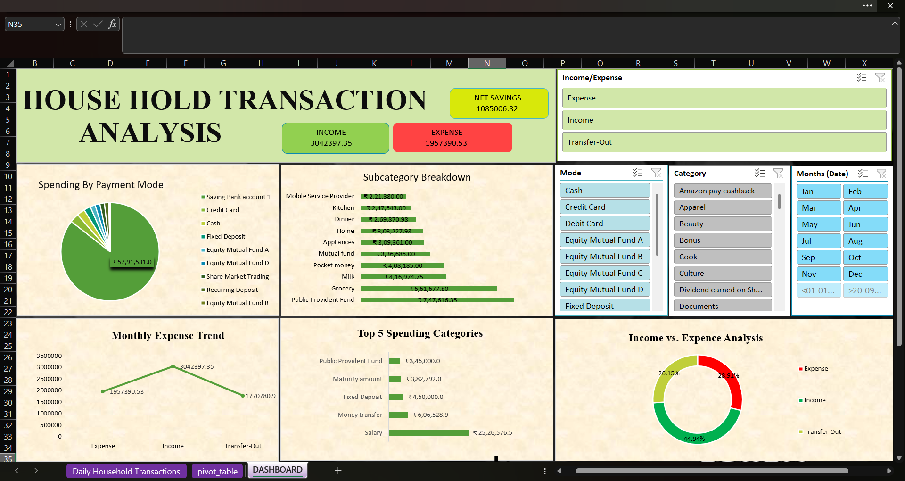

# House-Hold-Transaction-Analysis

This project presents an Excel-based dashboard that analyzes household financial data, including income, expenses, and savings. It helps in understanding monthly spending patterns and financial behavior.

Key Features
- KPI indicators for income, expenses, and net savings
- Visual charts showing monthly income vs. expense
- Category-wise spending analysis
- Interactive slicers for filtering by category or time

Tools Used
- Microsoft Excel
- Pivot Tables
- Charts (Bar, Line, Pie)
- Slicers for interactivity

Insights
- Identify months with overspending
- Understand major expense categories
- Track savings trends over time

